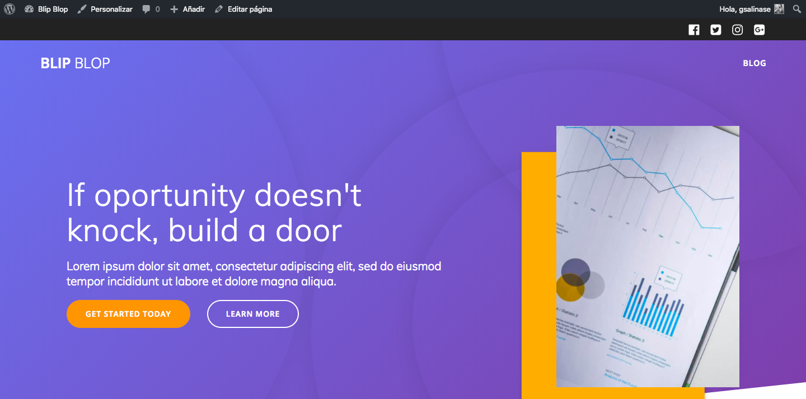

#-------->  Link a sitio en servidor http://186.64.118.50/~fev1vescobar/
# Deploy, SEO, y seguridad - Wordpress

## Deploy y seguridad en página empresa Kleaner

### Instrucciones:

Hace un par de semanas don Alberto nos pidió crear su nueva página web con contenido optimizado para los buscadores, a modo de competir de mejor manera con la empresa rival de **Kleaner** llamada **Limpiecito.cl**.

Don Alberto, nos llama preguntando si la página se encuentra lista para subirla a su servicio de hosting. Nosotros cumpliendo con las fechas establecidas respondimos que todo estaba listo para subir la página a internet.

Usando todo lo aprendido en la semana online haz un deploy automático de la página web de Kleaner.

Después de terminar el deploy, deberás integrar el sitio en producción dentro de Google Search Console, agregar un sitemap, y configurar todos los aspectos de esta plataforma.

Cuando estés listo, finaliza con un chequeo a la seguridad de tu sitio web.

> Si te queda tiempo integra [Google Analytics](https://albeiroochoa.com/como-instalar-google-analytics-mi-web/) en tu sitio web

### Requisitos generales:

- Haz un deploy usando el plugin Duplicator
- Integra y configura Google Search Console
- Crea un sitemap e intégralo en Google Search Console
- Revisa y verifica que los aspectos de seguridad del sitio web

Cuando termines crea un **README.md** que contenga lo siguiente:

- URL del sitio web en producción
- Screenshot de la integración de Google Search Console con el sitio web
- URL del sitemap creado
- Screenshot de la integración con Google Search Console
- Listado con los aspectos de seguridad que optimizaste dentro de la página web

Al finalizar debes enviar los cambios (vía push) y subir el link del repositorio a la sección correspondiente en la plataforma [empieza](https://empieza.desafiolatam.com "Desafío Latam").

##### **Mucha suerte!**
